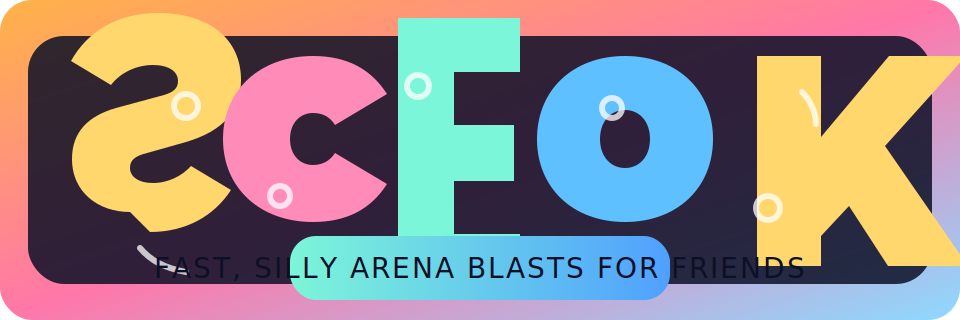

# Shiz-and-Giggles

<div align="center">
  
  <p><strong>Official arena shooter release</strong> · <em>Fast, frantic, and unapologetically arcade</em></p>
</div>

## Overview
Shiz-and-Giggles is a stylish, Quake-inspired arena FPS built for high-speed movement, expressive aim duels, and laugh-out-loud chaos. This repository powers the playable build, server tooling, and release packaging used for public playtests and partner drops.

## What’s inside
- **Polished HUD & UI shell** with scoreboards, kill feed, lobby browser, and responsive pause/settings flows.
- **Playable arenas** plus design-ready specs in `docs/arena_specs.md` for immediate blockout and lighting passes.
- **Dedicated server + client harness** (`shizgiggles` package) for smoketesting player movement, weapons, and 16+ client load scenarios.
- **Release automation** for nightly builds, regression tests, and packaged zips targeting itch.io or Steam private betas.

## Key features
- **Movement-first combat:** strafe jumps, rocket jumps, and air control tuned for 60–120 Hz tick rates.
- **Readable combat feedback:** crisp crosshair, hit indicators, kill feed animations, and scoreboard toggles.
- **Competitive-ready servers:** region-aware browser, ready checks, and cosmetic team selection (usable in FFA).
- **Performance-minded builds:** lightmaps and GPU instancing guidance, pooled VFX, and bandwidth-conscious replication.

## Platforms & technology
- **Engine:** Godot (playable client with HUD prototype and arena blockouts).
- **Backend/tooling:** Python-based dedicated server simulation, load testing utilities, and PyInstaller packaging.
- **CI/CD:** GitHub Actions nightly pipeline for builds, tests, and artifact uploads.

## Install & play
1. Clone the repo and create a virtual environment:
   ```bash
   python -m venv .venv
   source .venv/bin/activate
   pip install -e .[dev]
   ```
2. Launch a dedicated server (default port `8765`):
   ```bash
   shiz-server --port 8765
   ```
3. Connect a client and issue sample moves:
   ```bash
   shiz-client --port 8765 --player-id playtester --moves "1,0" "0,1" --fire
   ```
4. Stress test with synthetic clients:
   ```bash
   shiz-load-test --port 8765 --clients 16
   ```

## Nightly builds
The GitHub Actions workflow `.github/workflows/nightly.yml` builds debug-friendly client and dedicated server binaries with PyInstaller, runs regression tests, and uploads artifacts nightly. Artifacts include the changelog and version file.

## Packaging for itch.io / Steam private beta
Use `scripts/package_release.py` after running `scripts/build_artifacts.py` to bundle the latest build into `releases/<version>-<channel>.zip`. Pass `--itch-target` to push via `butler` or `--steam-script` to call `steamcmd` when available.

## Versioning and changelog
The current version lives in `VERSION` and is mirrored in `shizgiggles.__init__.__version__`. Update `CHANGELOG.md` with user-facing notes for each release.

## Playable client + dedicated server builds
1. Install Godot 4.2+ and expose it as `godot` on your PATH or via `GODOT_BIN=/path/to/godot`.
2. Build the binaries (Godot exports plus PyInstaller Python tools) into `dist/`:
   ```bash
   python -m venv .venv
   source .venv/bin/activate
   pip install -e .[dev]
   python scripts/build_artifacts.py
   ```
   - Use `--skip-godot` if you only need the Python CLI builds; `--godot-bin /path/to/godot` overrides the Godot binary.
3. Run the dedicated arena server export (auto-hosts on port `8910`):
   ```bash
   ./dist/godot/server/ShizAndGigglesServer.x86_64 --headless
   ```
4. Launch the playable client export and host/join a match from the main menu:
   ```bash
   ./dist/godot/client/ShizAndGiggles.x86_64
   ```
5. Package a release-ready zip (Godot builds, PyInstaller CLIs, changelog, and version metadata):
   ```bash
   python scripts/package_release.py --channel beta
   ```
   The archive is written to `releases/<version>-<channel>.zip` and is ready for itch.io/Steam uploads using the optional flags.

## Discord-ready portable zip (no Python or tools required)
Bundle everything needed to share the game as a single download (usable directly after extracting, no GitHub access or Python installs required):
```bash
python scripts/build_portable_bundle.py --name shiz-and-giggles-discord
```
- The script rebuilds one-file PyInstaller CLIs and Godot exports, then writes a zip in `portable/` with runnable binaries plus a quickstart README.
- Use `--skip-build` if you already have fresh artifacts in `dist/`, `--skip-godot` to ship only the CLIs, or `--omit-tools` to exclude the Python helpers.

## Windows `.exe` releases via GitHub
- Push a tag following the pattern `v*` (e.g., `v0.2.0`) or trigger the **Windows Release Build** workflow manually from the Actions tab.
- The workflow builds one-file PyInstaller executables for `shiz-client` and `shiz-server` on `windows-latest`, packages them with the changelog/version metadata, and uploads the zip to a GitHub Release when a tag is present.
- Manual runs without a tag still produce downloadable artifacts; grab them from the workflow run’s artifacts list.

# Performance Tuning Plan

This document outlines the actionable steps to optimize frame timing, rendering, and networking for the target hardware, with special attention to worst-case 16-player chaos scenarios.

## Profiling and Instrumentation
- Profile on target hardware early and continuously; collect captures for GPU, CPU, and memory during both solo play and 16-player stress scenes.
- Record frame time budgets separately for simulation (tick) and rendering, and log spikes with markers (e.g., weapon fire, VFX bursts, teleport events).
- Track perf regressions via automated captures on repeatable scenes (e.g., “16-player plaza chaos”), saving baseline CSVs for frame time, bandwidth, and CPU utilization.

## Frame Timing: Tick vs. Frame
- Decouple game tick from render frame when possible; clamp simulation rate (e.g., 60–120 Hz) and interpolate/extrapolate for display refresh variability.
- Tune tick rate to stay within CPU budget under peak load; use instrumentation to flag when the simulation overruns its budget.
- Enable frame pacing to smooth frame delivery; verify even frame spacing under VSync on/off and during large VFX bursts.
- Add a user-facing VSync toggle (with fallback to driver-controlled adaptive vsync) and persist the setting; default to VSync on for stability, but expose an unlocked option for latency-sensitive users.

## Rendering Optimizations
- Level of Detail (LOD): ensure meshes have at least 2–3 LODs; use screen-size thresholds validated on target displays. Audit hero assets visible in the 16-player chaos scene first.
- Lighting: bake static and stationary lighting where possible; minimize dynamic shadow casters. Use lightmaps/light probes for crowds and set conservative shadow draw distances.
- GPU instancing: instance repeatable props (cover objects, debris, foliage) and ensure material compatibility (no per-instance material variants where avoidable).
- VFX pooling: pool particle systems and decals; avoid per-spawn allocations. Pre-warm expensive effects used in chaotic encounters (e.g., explosions, ultimates).

## Networking and Bandwidth
- Monitor bandwidth and CPU usage during 16-player chaos scenes; log per-client and server CPU plus bandwidth (avg/peak).
- Tune net update rates per actor class (players > projectiles > ambient) and cap packet sizes to stay within MTU. Bundle small updates and avoid redundant component replication.
- Apply relevancy culling and priority-based throttling; lower update frequency for distant/occluded actors and cosmetic-only effects.
- Validate packet serialization costs on CPU; cache frequently sent payloads where safe and avoid per-frame heap allocations in replication paths.

## Checklist for Implementation
- [ ] Add automated perf capture on target hardware for the 16-player chaos scenario.
- [ ] Implement frame pacing verification and expose a VSync toggle with persisted user settings.
- [ ] Audit tick vs. frame timings; decouple and clamp simulation rate as needed.
- [ ] LOD audit and fixes for hero assets; enforce baked lighting on static geometry.
- [ ] Enable GPU instancing for repeatable props; ensure material compatibility.
- [ ] Introduce pooled VFX and pre-warm heavy effects.
- [ ] Instrument and tune network update rates, packet sizes, and relevancy rules during 16-player chaos tests.
Shiz-and-giggles is a fast-paced, Quake-inspired arena shooter. This guide covers how to host and join matches, the default controls, and best practices for configuring servers and contributing new content while preserving the game's classic feel.

## Quickstart

### Hosting a match
1. Launch a dedicated server:
   ```bash
   ./shiz-server +map q1dm1 +fraglimit 30 +timelimit 10 +sv_public 1
   ```
2. Open the necessary UDP port on your firewall (default: `27960`).
3. Share your IP/hostname and port with players.
4. Keep an eye on server logs for players joining and any configuration warnings.

### Joining a match
- From the main menu, choose **Find Server** and select a listed server.
- Or, connect directly via console:
  ```bash
  pytest
  ```

## Support
For playtest feedback, build issues, or server questions, open an issue on GitHub. Partners can reach the team via the private support channel for escalations.
